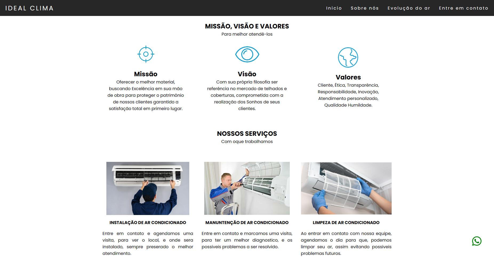

<h1 align="center">Idela Telhados</h1>

<!-- Getting Started -->
# Sobre o projeto
Site desenvolvida para uma empresa que desponibiliza serviços de manunteção de de ar condicionado e reforma em geral.
<a href="https://idealclimar.com.br/" target="_blanck">Visitar o site</a>

### INICIANDO O PROJETO

Para instalar o projeto em sua maquina siga os passos abaixo.

### INSTALAÇÃO

1. Clone o repositório

   ```sh
   git clone https://github.com/NiloMarcos/ideal-clima.git
   ```

2. Entre na pasta

   ```sh
   cd ideal-clima
   ```

3. Abra o arquivo .html

   ```sh
   Assim o site irá abrir em seu navegador.
   ```

### Tecnologias

<ul>
  <li>HTML</li>
  <li>CSS</li>
  <li>JavaScript</li>
</ul>


### Apresentação da aplicação

<p align="center">

<div>
  <p>Apenas uma demonstração, quer ver o site completo? <a href="https://idealclimar.com.br/" target="_blanck">Visitar</a></p>

   
   
</div>
